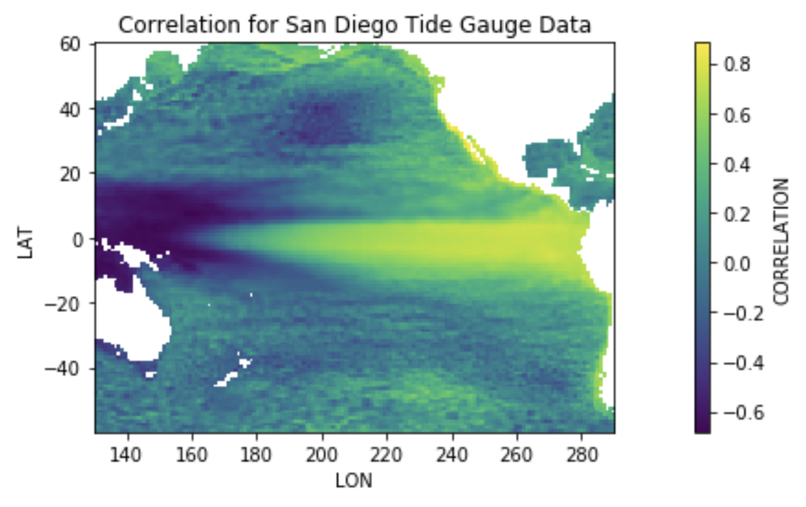

# 🌊 Pacific Sea Level Variability Analysis
### Satellite Altimetry · Tide Gauge Cross-Validation · 1993–2018


---

## Overview

This project analyzes **25 years of Pacific Ocean sea level data** (1993–2018) by fusing two independent observational systems:

- **Satellite altimetry** — gridded sea level anomaly (SLA) data across ~19,400 ocean grid points (121 lat × 161 lon)
- **Tide gauge records** — in-situ measurements from three stations: Honolulu (HI), San Diego (CA), and Mera (Japan)

The goal: decompose sea level signals into long-term trends, seasonal cycles, and residual anomalies — then map how well local tide gauge observations can predict sea level variability across the broader Pacific basin.

**Why this matters for climate:** Sea level rise is one of the most direct and measurable indicators of climate change. Understanding regional variability patterns — especially the ENSO-driven dynamics visible in this dataset — is foundational to coastal risk assessment, climate adaptation planning, and the physical science underpinning climate financial instruments.

---

## Key Findings

| Station | Sea Level Trend |
|---|---|
| 🏝️ Honolulu, HI | **+2.02 mm/year** |
| 🇺🇸 San Diego, CA | **+4.08 mm/year** |
| 🇯🇵 Mera, Japan | **+4.98 mm/year** |



**Spatial correlation analysis reveals:**

- **San Diego** anomalies show the strongest basin-wide predictive power — highly correlated with the equatorial cold tongue and eastern Pacific, with a striking negative correlation near Papua New Guinea and Australia. This pattern is a clear signature of **ENSO teleconnections**.
- **Honolulu** shows moderate positive correlation across the central Pacific — useful as a regional proxy but with less spatial reach.
- **Mera** is most predictive for the western Pacific (Japan, eastern China coast), and shows an opposing correlation pattern north of Hawaii compared to the other two stations — reflecting distinct North Pacific dynamics.

---

## Methodology

### 1. Signal Decomposition
For every grid point in the altimeter dataset, a multiple linear regression model is fit to extract:

```
SL(t) = trend·t + mean + A₁cos(2πt/365.25) + B₁sin(2πt/365.25)
                + A₂cos(4πt/365.25) + B₂sin(4πt/365.25) + ε
```

- **Trend** — long-term sea level rise (mm/year)
- **Mean** — time-mean sea level
- **Seasonal cycle** — annual + semi-annual harmonics
- **Residual (ε)** — sea level anomaly (SLA), the scientifically interesting signal

The same decomposition is applied independently to all three tide gauge records.

### 2. Cross-Validation: Altimeter ↔ Tide Gauge
After removing trends and seasonal cycles from both datasets, Pearson correlation and regression coefficients are computed between each tide gauge's anomaly time series and every ocean grid point in the altimeter data. This produces spatial maps of:
- Where each station's signal is most "felt" across the Pacific
- The gain (regression coefficient) relating local altimeter SLA to tide gauge SLA

### 3. Dominant Spatial Patterns
The correlation/regression maps are interpreted in the context of known Pacific climate modes — primarily **ENSO** (El Niño–Southern Oscillation), which drives large-scale sea level redistribution across the basin on interannual timescales.

---

## Repository Structure

```
sea-level-variability/
├── notebook/
│   └── sea_level_analysis.ipynb   # Full analysis notebook
├── outputs/
│   └── figures/                   # All generated plots
├── requirements.txt
└── README.md
```

> **Note on data:** The `.mat` source files (`ALT_Pacific.mat`, `TGdata.mat`) are not included due to size. They contain AVISO satellite altimetry and UHSLC tide gauge records respectively. Contact the repo owner or see [AVISO+](https://www.aviso.altimetry.fr/) and [UHSLC](https://uhslc.soest.hawaii.edu/) for access.

---

## Output Visualizations

The notebook produces six spatial maps and multiple time series plots:

| Output | Description |
|---|---|
| `sl_range.png` | Peak-to-peak sea level range across the Pacific |
| `sl_trend.png` | Linear sea level trend (mm/year) at each grid point |
| `sl_seasonal_std.png` | Std. deviation of the fitted seasonal cycle |
| `tg_*_correlation.png` | Correlation maps for each tide gauge (×3) |
| `tg_*_regression.png` | Regression coefficient maps for each tide gauge (×3) |
| `tg_*_anomalies.png` | Anomaly time series for Honolulu, San Diego, Mera |

---

## Setup & Usage

```bash
git clone https://github.com/YOUR_USERNAME/sea-level-variability.git
cd sea-level-variability
pip install -r requirements.txt
jupyter notebook notebook/sea_level_analysis.ipynb
```

---

## Requirements

See `requirements.txt`. Core dependencies:

- `numpy`, `scipy` — data I/O and signal processing
- `pandas` — time index handling
- `scikit-learn` — multiple linear regression
- `matplotlib`, `seaborn` — visualization
- `mpl_toolkits` — colorbar layout

---

## Climate Context

This analysis was conducted as part of an undergraduate oceanography course. The methods here — spatiotemporal regression, anomaly decomposition, satellite/in-situ data fusion — are directly applicable to:

- **Physical climate risk modeling** (coastal flooding exposure, SLR projections)
- **Climate data pipelines** for ESG and climate finance applications
- **Validation frameworks** for satellite-derived climate datasets

---

## License

MIT — free to use and adapt with attribution.
